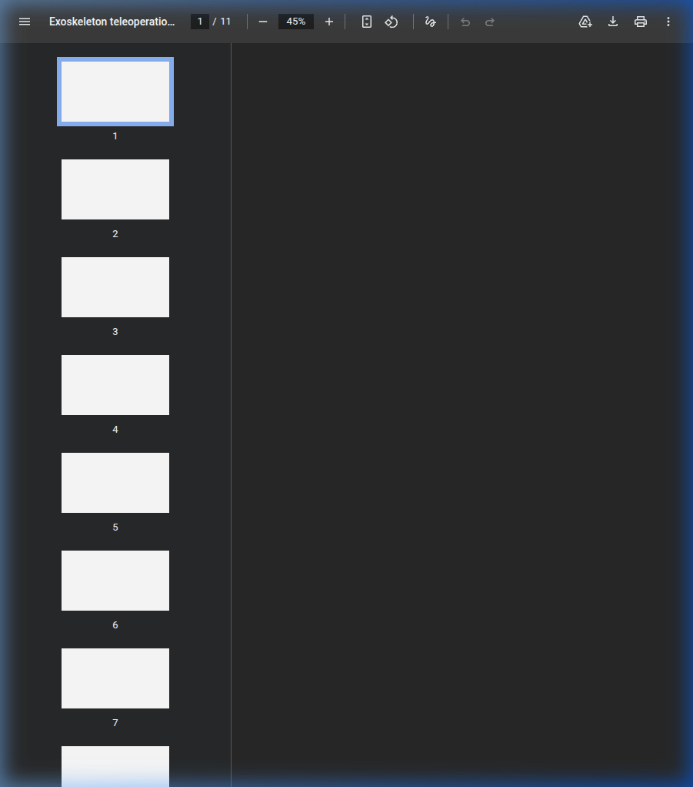
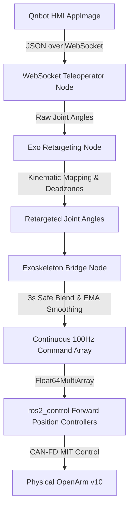

# OpenArm Bimanual Exoskeleton Teleoperation


This package provides a complete, low-latency teleoperation stack for controlling the bimanual OpenArm v10 using a wearable exoskeleton. It bridges raw exoskeleton data via WebSocket, performs kinematic retargeting, and securely interfaces with the `ros2_control` hardware interface.

<p align="center">
  
</p>

## Features
- **Bimanual Teleoperation**: Full 7-DOF per arm + gripper control.
- **Safe Startup Interpolation**: Prevents violent hardware jerks by smoothly blending from the robot's current resting pose to the operator's pose over 3 seconds when connecting.
- **Continuous Gripper Holding**: Overcomes physical resistance by applying a continuous 100Hz position holding torque with an integrated deadzone and "over-squeeze" mapping.
- **EMA Smoothing**: Real-time Exponential Moving Average filtering eliminates sensor jitter from the exoskeleton.
- **Simulation & Real Hardware Modes**: Easily test in RViz or execute on the physical CAN-bus connected robot.

---

## 🚀 Quick Start (Run Code)

A unified orchestration script `teleop_sim.sh` is provided in the `scripts/` directory to handle all workspace sourcing, automated CAN interface bring-up, and ROS 2 launch sequencing.

### Run in Simulation (Fake Hardware)
Use this mode to visualize the retargeting and teleoperation in RViz without physical hardware.
```bash
./scripts/teleop_sim.sh sim
```

### Run on Real Hardware
Ensure the robot is powered on and the USB-CAN adapters are plugged in. The script will automatically bring up `can0` and `can1`.
```bash
./scripts/teleop_sim.sh real
```

### Connect the Exoskeleton (HMI)
Once the launch file is running:
1. Open the **Qnbot HMI AppImage** on your network.
2. Set the forwarding address to: `ws://localhost:19091`
3. Click **STOP** forwarding.
4. Wear the exoskeleton and assume a comfortable starting position.
5. Click **START** forwarding.
   > *Note: The physical robot will take 3 seconds to smoothly blend into your starting position.*

---

## Architecture Pipeline



1. **WebSocket Teleoperator Node**
   Listens on port `19091` for incoming JSON packets from the Qnbot HMI containing raw joint angles.
2. **Exo Retargeting Node**
   Translates raw exoskeleton sensor data into a physical coordinate space, mapping trigger pulls to gripper aperture sizes, complete with mechanical deadzones.
3. **Exoskeleton Bridge Node**
   Receives the retargeted targets. Applies safety EMA smoothing and startup positional blending. Publishes a continuous 100Hz `Float64MultiArray` to the forward position controllers.

## Launch Parameters
You can adjust the following parameters inside the `teleop_sim_full.launch.py` or `exoskeleton_bridge.launch.py`:
- `blend_time` (default: 3.0s): Time to interpolate to the exoskeleton's first position.
- `smooth_alpha` (default: 0.15): EMA filter coefficient (lower = smoother but slightly more latent).
- `gripper_scaling_factor` (default: 0.05): Calibration multiplier for the physical gripper.
