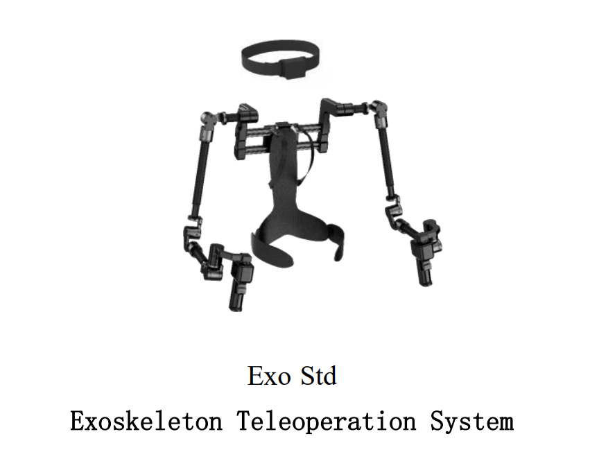
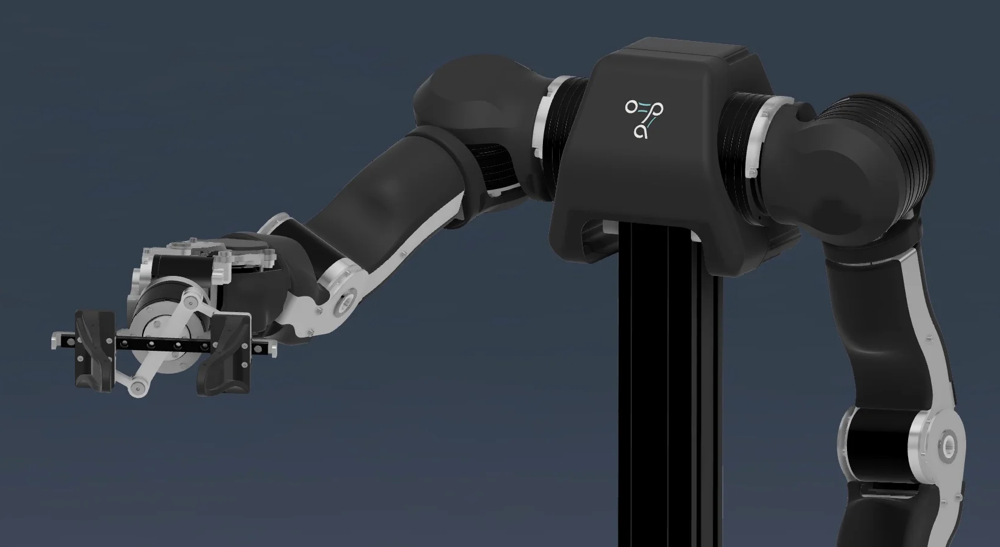

# 7DOF-OArm Bimanual Exoskeleton Teleoperation



A complete, low-latency teleoperation and data-collection stack for a bimanual
7DOF-OArm robot driven by a wearable exoskeleton. It bridges raw exoskeleton
data over WebSocket, performs kinematic retargeting, and drives the arms through
the `ros2_control` hardware interface — plus a web UI for calibration, dataset
recording, training and policy rollout.

<p align="center">
  
</p>

## Features

- **Bimanual teleoperation** — full 7-DOF per arm plus gripper.
- **Safe startup interpolation** — blends from the robot's current resting pose
  to the operator's pose over 3 seconds, so connecting never jerks the hardware.
- **Continuous gripper holding** — 100 Hz position-holding torque with a
  deadzone and over-squeeze mapping, to overcome physical resistance.
- **EMA smoothing** — removes exoskeleton sensor jitter in real time.
- **Simulation and real hardware** — visualize in RViz, or run on the physical
  CAN-bus robot.
- **Web UI (leLab)** — calibration, teleop, dataset recording and replay,
  training and rollout, served from a single process on `:8000`.

---

## Installation

```bash
pip install -r requirements.txt
```

Use Python 3.12+ for the full workspace, especially the leLab UI.

This installs the Python packages used by the workspace utilities and the UI.
It does **not** install ROS 2, CAN drivers, or other system-level dependencies —
set those up separately for real hardware. The launcher performs startup checks
for the common failures (missing CAN interfaces, unbuilt workspace packages).

Build the ROS 2 workspace before the first run:

```bash
colcon build --symlink-install
```

## Quick start

`oarm7dof_teleop.sh` in the workspace root is the single entry point. It sources
the workspace and starts the WebSocket server, retargeting, robot bring-up and
the exoskeleton bridge.

### Simulation (no hardware)

```bash
./oarm7dof_teleop.sh --ws-port 19191
```

### Real hardware

Power the robot, plug in the USB-CAN adapters, then configure the interfaces:

```bash
sudo ip link set can0 down
sudo ip link set can0 type can bitrate 1000000 dbitrate 5000000 fd on
sudo ip link set can0 up

sudo ip link set can1 down
sudo ip link set can1 type can bitrate 1000000 dbitrate 5000000 fd on
sudo ip link set can1 up
```

```bash
./oarm7dof_teleop.sh --real --ws-port 19191
```

Add `--lelab` to also serve the web UI.

### Waveshare USB-CAN-FD-B

The robot talks SocketCAN (`can0`/`can1`), so the adapter model does not change
any robot code — it only has to expose SocketCAN interfaces.

1. Install/load the Waveshare Linux driver so the adapter creates `can0`/`can1`.
2. Verify: `ip link show can0 && ip link show can1`
3. Run in CAN-FD mode:

```bash
./oarm7dof_teleop.sh --real --can --waveshare --ws-port 19191 --lelab
```

Custom rates (Waveshare's default FD data path is 5 Mbps):

```bash
./oarm7dof_teleop.sh --real --can --waveshare --can-bitrate 1000000 --can-data-bitrate 5000000 --ws-port 19191
```

Notes:
- `--can` is an alias of `--real`.
- `--waveshare` enables CAN-FD configuration (`fd on`, `dbitrate`).
- Without `--waveshare` the launcher uses plain SocketCAN setup.

### Connect the exoskeleton (HMI)

With the launcher running:

1. Open the Qnbot HMI AppImage on your network.
2. Set the forwarding address to `ws://localhost:19191`.
3. Click **STOP** forwarding.
4. Wear the exoskeleton and take a comfortable starting position.
5. Click **START** forwarding.

> The robot takes 3 seconds to smoothly blend into your starting pose.

---

## Architecture

1. **WebSocket teleoperator node** — listens on `19191` for JSON packets from
   the HMI carrying raw joint angles.
2. **Exo retargeting node** — maps raw exoskeleton readings into the robot's
   coordinate space, including trigger-pull to gripper aperture with mechanical
   deadzones.
3. **Exoskeleton bridge node** — seeds commands from `/joint_states`, applies
   EMA smoothing and optional per-step slew limits, and publishes
   `Float64MultiArray` to the forward position controllers.

Tunable parameters live in `exoskeleton_bridge.launch.py`:

- `smooth_alpha` (default `0.15`) — EMA coefficient; lower is smoother but
  adds latency.
- `gripper_scaling_factor` (default `0.05`) — physical gripper calibration
  multiplier.

## Recorded observation layout

A recorded frame is laid out as:

| Slice     | Contents                                                                   |
|-----------|----------------------------------------------------------------------------|
| `[0:8]`   | left joint positions (radians)                                             |
| `[8:16]`  | right joint positions (radians)                                            |
| `[16:30]` | `ee_pose` — `[left_xyz, left_quat, right_xyz, right_quat]`                  |
| `[30:32]` | `gripper_state` — `[left_finger, right_finger]`                            |

The `ee_pose` and `gripper_state` blocks are **optional and off by default** —
they are derived values, not measurements. Enable them under
**I/O Configuration → End-effector pose in observations** in the web UI if your
policy needs them; otherwise a dataset records only the 16 raw joint positions,
matching the 16 actions.

## Dataset utilities

Check a recorded dataset for dropped frames, torque spikes and schema problems:

```bash
python3 check_dataset_health.py <user>/<dataset> --cap-nm 2.0
```

Visualize teleop/record synchronisation for a recorded episode:

```bash
python3 lelab_ui/lelab/scripts/visualize_sync.py ~/.cache/huggingface/lerobot/<user>/<dataset>
```

## Repository layout

| Path                            | Contents                                             |
|---------------------------------|------------------------------------------------------|
| `oarm7dof_teleop.sh`            | unified launcher                                     |
| `src/qnbot_teleoperator/`       | teleop, retargeting and bridge nodes                 |
| `lelab_ui/`                     | FastAPI + React web UI (`lelab/`, `frontend/`)       |
| `deploy_act_policy.py`          | run a trained ACT policy on the hardware             |
| `calibrate_arms.py`             | joint-limit and zero calibration over CAN            |
| `safety_watchdog.py`            | independent limit/torque watchdog                    |

Packages under `src/` prefixed `openarm_` are vendored third-party ROS 2
packages (Apache-2.0) providing the robot description, CAN library and
`ros2_control` hardware interface. They are kept unmodified, with their original
`LICENSE` files, so upstream fixes can still be merged — do not rename or
refactor them.
